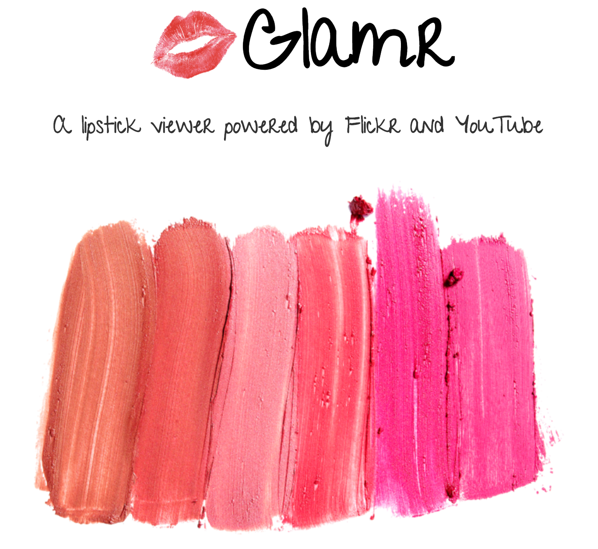
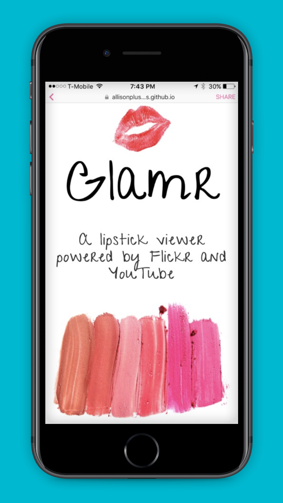
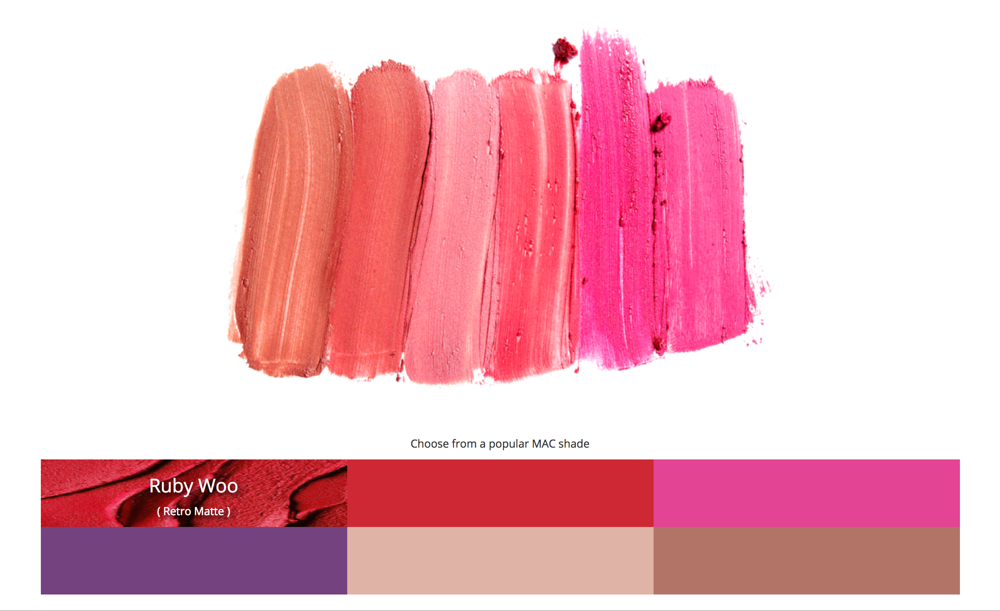
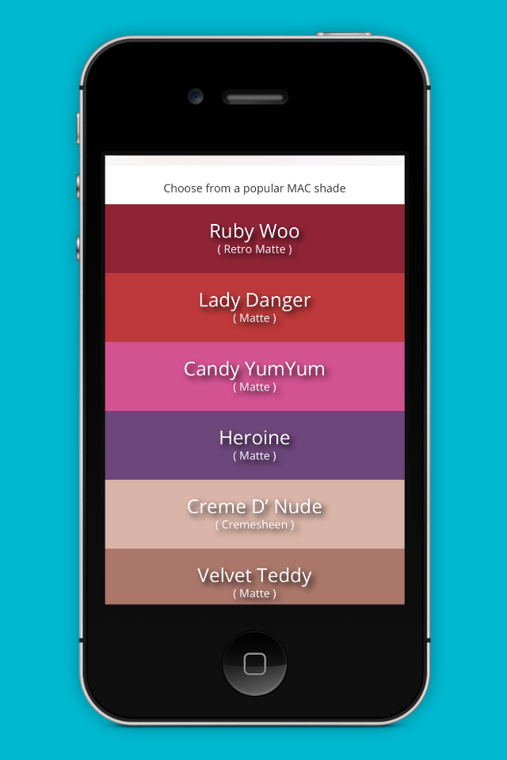
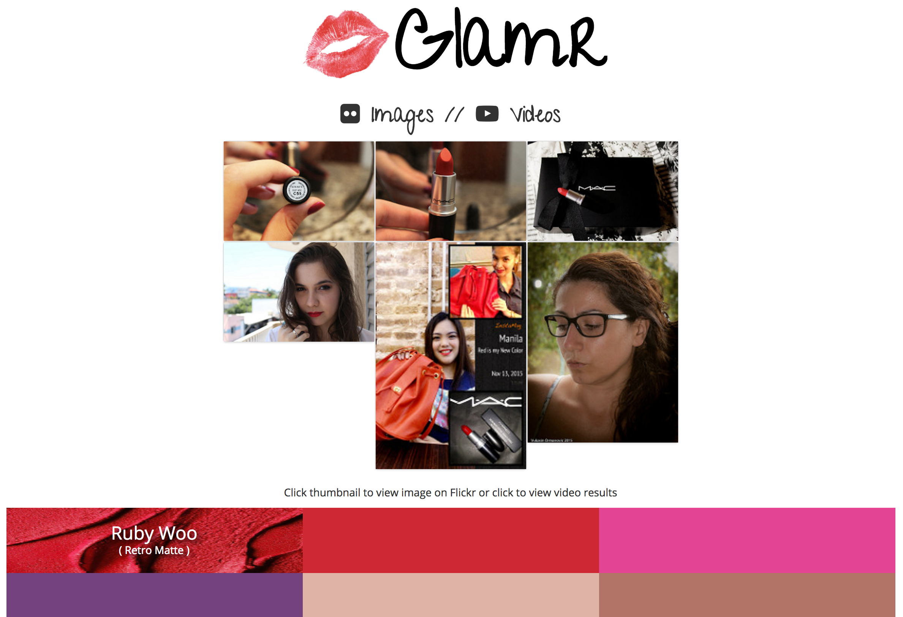

# Glamr

## A lipstick color viewer powered by the Flickr and YouTube APIs.

This passion project was inspired by my love of lipstick and wanting a way to quickly and beautifully preview colors I am interested in adding to my collection.

Glamr was built using HTML, CSS, Bootstrap, jQuery, Ajax, and the Flickr and YouTube APIs. The resulting photo collage was built with Masonry and is fully mobile-responsive.

The user is prompted to choose from an interactive grid of popular MAC lipstick shades to view on their desktop or mobile device.

The most recent photos tagged with that lipstick on Flickr are then displayed in a collage created with Masonry. The user can then hover to get the title of that photo or click to view that image directly on Flickr. Alternatively, the user can select to view videos of that same lipstick shade on YouTube and click the thumbnail to watch on YouTube.

[Click here](http://glamr.io) to view the live version of this project.
